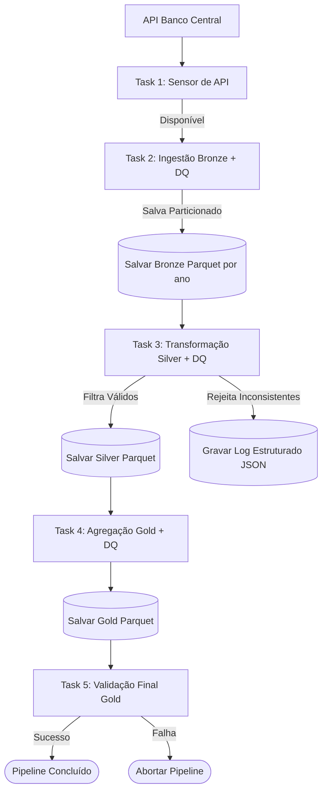

# Pipeline de Dados Taxa SELIC — Data Platform Engineer

Este projeto implementa um pipeline de dados de extração, transformação, carga (ETL) e agregação analítica para a taxa SELIC diária do Banco Central do Brasil. A orquestração das tarefas é gerenciada pelo **Apache Airflow** rodando em containers via **Docker Compose**.

Este pipeline adota o conceito de **Data Quality Checks** integrados em todas as camadas e realiza a validação de integridade antes da conclusão do fluxo.

---

## 1. Arquitetura da Solução

O pipeline está estruturado em camadas físicas e conta com validações obrigatórias de qualidade (Quality Gates) executadas na memória:



### Camadas e Fluxo de Dados
1. **Sensor de Disponibilidade (Task 1):** Um sensor baseado em polling que valida a conectividade e disponibilidade da API do Banco Central antes de iniciar o processamento real de dados.
2. **Ingestão - Camada Bronze (Task 2):** Consome dados reais da API do Banco Central, aplica validações de qualidade básica (Bronze DQ) na memória e persiste os dados em formato Parquet **particionados fisicamente no disco por ano** (`data/bronze/selic_raw/ano=YYYY/*.parquet`).
3. **Transformação - Camada Silver (Task 3):** Lê as partições da Bronze, identifica e isola registros inválidos (nulos, formatos corrompidos de data, taxas negativas ou fora do intervalo de negócio de 2020-2024). 
   * **Rejeição e Log Estruturado**: Os registros inválidos são removidos do fluxo de processamento e gravados em um arquivo JSON de auditoria (`data/silver/logs/rejected_records.json`), sendo também impressos no log do Airflow no formato JSON para facilidade de parse por ferramentas de log.
   * Os registros válidos são normalizados e salvos em `data/silver/selic_clean/clean_data.parquet`.
4. **Agregação - Camada Gold (Task 4):** Consome os dados limpos da Silver e gera as visões agregadas exigidas (média mensal simples e variação composta anual), gravando-as em `data/gold/metricas_mensais/metricas_mensais.parquet` e `data/gold/metricas_anuais/metricas_anuais.parquet`.
5. **Validação Final - Integridade da Gold (Task 5):** Lê as tabelas finais da Gold e realiza uma auditoria rigorosa (quantidade exata de meses/anos esperados no ciclo de 2020-2024, ausência de nulos e consistência de valores). Falhas nesta etapa interrompem o pipeline com erro para alertar a operação.

---

## 2. Decisões Técnicas

* **Módulo Central de Qualidade (`utils/dq_checks.py`):** Centraliza a lógica de validação `validate_dataframe` utilizando o **Great Expectations v1.0+** em um módulo compartilhado. Isso evita a duplicação de lógica entre as tasks, garantindo que todas as validações ocorram de forma fluida e transacional em memória usando contextos efêmeros.
* **Cálculo Acumulado Financeiro (Mensal e Anual):** A taxa SELIC é capitalizada de forma composta diariamente. Para obter a variação acumulada de um determinado período (mês ou ano), o pipeline converte a taxa diária $r_t$ no fator diário $1 + \frac{r_t}{100}$, realiza o produtório desses fatores para o período correspondente, e reconverte para taxa percentual.
* **Tratamento de Registros Inválidos (Rejeição vs Abortar)**: Para a camada Silver, adotou-se uma postura de tolerância a falhas na carga diária individual: em vez de derrubar todo o pipeline caso haja apenas alguns registros corrompidos na API, o pipeline isola/rejeita estes registros em um log estruturado (`rejected_records.json`) permitindo que a grande massa de dados válidos prossiga de forma segura.
* **Uso do Argparse para Execução via Linha de Comando (CLI):** Todas as tasks de processamento contêm um ponto de entrada `__main__` configurado com `argparse` para aceitar obrigatoriamente o parâmetro `--base-dir`. Isso facilita testes manuais locais sem a necessidade de acoplar caminhos relativos fixos.
* **Parametrização e CI/CD via GitOps (`selic_bcb.json`):** Para viabilizar deploys consistentes entre ambientes sem necessidade de alterações manuais no código ou em variáveis de ambiente, o pipeline é parametrizado pelo arquivo `selic_bcb.json` (definindo `dag_id`, `schedule_interval`, `retries`, `retry_delay` e `base_dir`). No repositório, mantêm-se dois arquivos de template: `selic_bcb_DES.json` (desenvolvimento) e `selic_bcb_PROD.json` (produção). Na esteira de CI/CD:
  - **Task de deploy na branch `DES`**: Exclui o arquivo `selic_bcb_PROD.json` e renomeia `selic_bcb_DES.json` para `selic_bcb.json`.
  - **Task de deploy na branch `PROD` (após merge do PR)**: Exclui o arquivo `selic_bcb_DES.json` e renomeia `selic_bcb_PROD.json` para `selic_bcb.json`.
* **Idempotência Garantida:** As operações de escrita de arquivos limpam previamente quaisquer arquivos Parquet e partições antigas nos diretórios de destino das camadas Bronze, Silver e Gold, prevenindo duplicação de dados históricos ou acúmulo de arquivos órfãos em execuções sucessivas.

---

## 3. Como Executar Localmente

### Pré-requisitos
* **Docker Desktop** (com suporte a Docker Compose) instalado.
* **Python 3.10 ou superior** instalado (para execução de scripts Python localmente com ambiente virtual gerenciado).

### Execução via Airflow (Docker Compose)

1. **Inicialize o banco de metadados do Airflow** (apenas na primeira vez):
   ```bash
   docker compose up airflow-init
   ```
2. **Suba os serviços em segundo plano**:
   ```bash
   docker compose up -d
   ```
3. **Acesse o Dashboard**:
   * URL: [http://localhost:8080](http://localhost:8080)
   * Usuário: `admin`
   * Senha: `admin`
4. **Ative a DAG** `pipeline_taxa_selic` e dispare a execução.

### Execução Manual de Tarefas (CLI)

Se preferir rodar as tarefas individualmente sem o Airflow, ative seu ambiente Python local e execute-as utilizando o módulo Python correspondente:

```bash
# 1. Executa a Ingestão (Bronze)
python -m tasks.selic_bcb.bronze.ingest --base-dir data

# 2. Executa a Transformação (Silver)
python -m tasks.selic_bcb.silver.transform --base-dir data

# 3. Executa a Agregação (Gold)
python -m tasks.selic_bcb.gold.aggregate --base-dir data

# 4. Executa a Validação Final (Integridade)
python -m tasks.selic_bcb.gold.validate --base-dir data
```

---

## 4. Dicionário de Dados do Pipeline

### 4.1. Camada Bronze (`data/bronze/selic_raw/ano=YYYY/*.parquet`)
Contém os dados brutos extraídos diretamente da API SGS do Banco Central, particionados por ano.

| Nome da Coluna | Tipo de Dado | Descrição | Exemplo |
| :--- | :--- | :--- | :--- |
| `data` | `string` | Data de referência da taxa diária no formato originário (DD/MM/AAAA). | `"02/01/2020"` |
| `valor` | `string` | Valor da taxa SELIC diária como string de ponto flutuante. | `"0.017089"` |
| `ano` | `string` | Ano de particionamento físico extraído da data de referência. | `"2020"` |

---

### 4.2. Camada Silver (`data/silver/selic_clean/clean_data.parquet`)
Contém os dados limpos, tipados, sem duplicados e filtrados cronologicamente (2020-2024).

| Nome da Coluna | Tipo de Dado | Descrição | Exemplo |
| :--- | :--- | :--- | :--- |
| `data` | `date` | Data de referência da taxa diária formatada (YYYY-MM-DD). | `2020-01-02` |
| `valor` | `float64` | Valor da taxa SELIC diária convertida para número real (%). | `0.017089` |
| `ano` | `int32` | Ano correspondente obtido a partir da data de referência. | `2020` |
| `mes` | `int32` | Mês correspondente obtido a partir da data de referência. | `1` |

---

### 4.3. Camada Gold - Métricas Mensais (`data/gold/metricas_mensais/metricas_mensais.parquet`)
Contém as agregações mensais calculadas (médias aritméticas simples e variações acumuladas compostas).

| Nome da Coluna | Tipo de Dado | Descrição | Exemplo |
| :--- | :--- | :--- | :--- |
| `ano` | `int64` | Ano de referência do cálculo (2020 a 2024). | `2020` |
| `mes` | `int64` | Mês de referência (1 a 12). | `8` |
| `media_mensal` | `float64` | Média aritmética simples da taxa SELIC diária no mês (%). | `0.007621` |
| `variacao_mensal` | `float64` | Taxa SELIC acumulada de forma composta no mês (%). | `0.165239` |

---

### 4.4. Camada Gold - Métricas Anuais (`data/gold/metricas_anuais/metricas_anuais.parquet`)
Contém as taxas acumuladas de juros compostos calculadas para cada ano completo.

| Nome da Coluna | Tipo de Dado | Descrição | Exemplo |
| :--- | :--- | :--- | :--- |
| `ano` | `int64` | Ano de referência do cálculo (2020 a 2024). | `2023` |
| `taxa_acumulada_anual` | `float64` | Taxa acumulada de forma composta ao longo de todo o ano (%). | `13.041235` |

---

## 5. Sugestões de Melhorias para Produção

Para escalar e robustecer a aplicação em um ambiente produtivo real, recomendam-se as seguintes melhorias:

### 5.1. Segurança de Rede e Acesso Remoto
* **Proxy Reverso e HTTPS (Nginx)**: Habilitar o acesso remoto ao servidor web do Airflow por meio de um proxy reverso usando **Nginx**, configurando criptografia ponta a ponta com certificados SSL/TLS (HTTPS) emitidos por autoridades como Let's Encrypt.
* **Ocultação de IPs e Portas via Domínio**: Utilizar domínios privados ou serviços dinâmicos de DNS (como DuckDNS para ambientes de homologação/desenvolvimento) para ocultar o endereço IP público e as portas de escuta direta (ex: `8080`), reduzindo a exposição a varreduras de portas maliciosas.
* **Restrição de Acesso por VPN**: Proibir a exposição pública do webserver na internet aberta, exigindo que os usuários estejam autenticados em uma VPN corporativa privada ou malha de rede segura (como **Tailscale** ou **OpenVPN**) para conseguir acessar a console.
* **Autenticação Multifatorial (MFA)**: Ativar a autenticação de dois fatores (2FA/MFA) na camada do webserver do Airflow ou por meio de integração com provedores de identidade corporativos (como OKTA, Microsoft Entra ID ou Google Workspace via OAuth).

### 5.2. Armazenamento Distribuído e Escalável (Object Storage)
* **Substituição de Armazenamento Local**: Em vez de persistir os arquivos das camadas Bronze, Silver e Gold em volumes locais montados nos contêineres, deve-se adotar soluções de **Object Storage** distribuído altamente resilientes e escaláveis. 
* **Tecnologias Recomendadas**: Integração nativa com buckets **Amazon S3**, **Azure Data Lake Storage Gen2 (ADLSg2)**, ou instâncias privadas do **MinIO** (on-premise). Isso previne a perda de dados em caso de falha física das máquinas dos workers e melhora a integração com ferramentas analíticas externas (ex: Athena, Databricks, Snowflake).

### 5.3. Desacoplamento de Computação e Orquestração
* **O Problema do Airflow como Engine de Transformação**: Atualmente, as transformações de dados (processamento de arquivos Parquet e computação de taxas de juros) ocorrem localmente na CPU/Memória onde as tasks do Airflow estão sendo executadas. Em ambientes de produção, o Airflow é comumente alocado em instâncias de máquinas virtuais (VMs) muito pequenas e econômicas para otimizar custos. 
* **Risco de Queda de Contêiner**: Processar volumes de dados moderados a grandes (como agrupamentos pesados via Pandas) diretamente dentro do contêiner do scheduler/worker do Airflow pode facilmente esgotar os recursos de memória da máquina host (OOM - Out of Memory), resultando na derrubada de contêineres vitais do Airflow e interrompendo toda a operação da plataforma.
* **Boas Práticas de Engenharia**: O papel do Airflow deve ser estritamente de **orquestração** e controle de fluxo. As transformações pesadas devem ser delegadas para mecanismos de computação distribuída ou processamento sob demanda externos, tais como:
  * **Databricks / AWS EMR / Apache Spark**: Executando scripts em clusters dedicados de computação em lote.
  * **dbt (data build tool)**: Gerenciando transformações em lote dentro de Data Warehouses (ELT).
  * **AWS ECS/Fargate ou Google Cloud Run**: Executando containers serverless independentes e sob demanda para processamento pesado, onde o Airflow apenas dispara o job e monitora seu status final.

---

## 6. Orquestração e Monitoramento no Kubernetes (Kind)

Como alternativa de nível de produção ao Docker Compose, este repositório inclui manifestos Kubernetes para rodar o pipeline no **Kind (Kubernetes in Docker)**, implementando **Alta Disponibilidade (HA)** e **Monitoramento Visual**.

### 6.1. Justificativa das Ferramentas Escolhidas

*   **Kind (Kubernetes in Docker)**: O Kind executa clusters locais do Kubernetes usando contêineres do Docker como nós do cluster. Ele foi escolhido por ser extremamente leve, rápido para inicializar, e por permitir testar manifestos Kubernetes complexos (PVs, Deployments, Jobs) localmente antes de subi-los para nuvem (como EKS, AKS ou GKE).
*   **Alta Disponibilidade (HA) no Airflow**:
    *   **Webserver (2 Réplicas)**: Múltiplas instâncias do webserver dividem a carga de acessos à console. Graças a probes de saúde HTTP (`liveness` e `readiness`), o Kubernetes remove automaticamente qualquer réplica defeituosa do balanceador sem interromper a navegação do usuário.
    *   **Scheduler (2 Réplicas Ativas-Ativas)**: O Airflow 2.0+ suporta múltiplos schedulers ativos concorrentes. Se um scheduler cair ou sofrer travamento na CPU, a outra réplica assume a orquestração e execução de tarefas imediatamente, garantindo resiliência contra falhas críticas de infraestrutura.
*   **Persistent Volume & Claim (`hostPath`)**: Configura o mapeamento em tempo real do repositório de desenvolvimento local para a pasta `/mnt/data` dentro do nó do Kubernetes. Permite que as execuções de dados dentro dos contêineres apareçam instantaneamente no seu sistema host.
*   **Postgres**: Banco de dados relacional para gerenciar o estado centralizado e as travas de concorrência dos Schedulers em HA.
*   **Kubernetes Dashboard (Visual Web)**: Interface visual para acompanhamento gráfico da saúde do cluster (uso de memória/CPU por Pod, eventos do cluster, logs interativos em tempo real). Evita a necessidade de executar comandos kubectl complexos no dia a dia.
*   **K9s (Terminal UI)**: Uma ferramenta de console ultraveloz e leve que exibe um painel completo para visualização rápida de logs, Pods e exclusão manual de contêineres para testes de resiliência.
*   **OpenLens (Desktop IDE)**: Um console para desktop profissional que fornece telemetria em tempo real, depuração de erros e diagramação visual da infraestrutura k8s.

---

### 6.2. Instalação e Configuração das Ferramentas do Kubernetes

Para rodar este ambiente localmente, é necessário ter instalado o **Docker**, o **kubectl** (CLI de controle do Kubernetes) e o **Kind**. Siga as instruções abaixo de acordo com o seu sistema operacional:

#### Windows (via PowerShell / cmd)
O método mais rápido e seguro no Windows é utilizar o gerenciador de pacotes nativo **Winget**:
1. **Docker Desktop**: Baixe e instale pelo [site oficial do Docker](https://www.docker.com/products/docker-desktop/) ou instale via terminal:
   ```powershell
   winget install Docker.DockerDesktop
   ```
2. **Kubectl**: Instale a CLI de gerenciamento do Kubernetes:
   ```powershell
   winget install Kubernetes.cli
   ```
3. **Kind**: Instale o orquestrador local:
   ```powershell
   winget install Kubernetes.kind
   ```
   *Nota: Caso o terminal não reconheça o comando `kind` logo após a instalação, reinicie seu terminal ou adicione o caminho do executável no seu PATH.*

---

### 6.3. Como Executar e Deployar o Pipeline

O pipeline foi projetado para rodar tanto em um ambiente de produção local altamente disponível (Kubernetes) quanto em um ambiente simplificado de desenvolvimento rápido (Docker Compose). O comportamento lógico do pipeline, validações e dados gerados são **100% idênticos** em ambos os métodos.

---

#### Opção A: Executar via Kubernetes (Kind) - Alta Disponibilidade (Recomendado)

Esta opção instala o cluster Kubernetes local simulando um ambiente produtivo real com **Alta Disponibilidade (HA)** (2 réplicas de Webserver e 2 réplicas de Scheduler) e provisiona o **Kubernetes Dashboard**.

##### Método Automatizado (Zero-Touch)
Execute o script PowerShell a partir da raiz do projeto para validar os pré-requisitos, criar o cluster, configurar os volumes, inicializar a base de dados, subir as réplicas em HA e iniciar os túneis de acesso local (Port-Forward e Proxy) automaticamente:
```powershell
.\deploy-kubernetes.ps1
```

##### Método Manual (Passo a Passo)
1. **Criar o Cluster Kind com Mount do Repositório:**
   ```bash
   kind create cluster --config kind-config.yaml --name selic-pipeline --image kindest/node:v1.29.2
   ```
2. **Pré-carregar a Imagem do Airflow:**
   ```bash
   kind load docker-image apache/airflow:2.8.1-python3.10 --name selic-pipeline
   ```
3. **Aplicar Volumes, Configurações e Postgres:**
   ```bash
   kubectl apply -f kubernetes/airflow-volumes.yaml
   ```
   ```bash
   kubectl apply -f kubernetes/airflow-configmap.yaml
   ```
   ```bash
   kubectl apply -f kubernetes/postgres.yaml
   ```
   *(Aguarde o pod `postgres-db-*` ficar no estado `Running`.)*
4. **Inicializar a Base de Dados do Airflow:**
   ```bash
   kubectl apply -f kubernetes/airflow-init-job.yaml
   ```
   *(Aguarde o job `airflow-init` ficar no estado `Completed`.)*
5. **Implantar a Stack HA (Webserver + Scheduler):**
   ```bash
   kubectl apply -f kubernetes/airflow-webserver.yaml
   ```
   ```bash
   kubectl apply -f kubernetes/airflow-scheduler.yaml
   ```
6. **Redirecionar a porta para acesso no navegador:**
   ```bash
   kubectl port-forward svc/airflow-webserver 8080:8080
   ```

---

#### Opção B: Executar via Docker Compose - Desenvolvimento Rápido

Esta opção é ideal para desenvolvimento local simplificado ou depuração rápida de código, sem o overhead de gerenciar um cluster Kubernetes.

##### Como Executar:
1. Abra um terminal na raiz do projeto.
2. Certifique-se de que o Docker Desktop está ativo.
3. Suba a stack com o comando:
   ```bash
   docker compose up -d
   ```
4. O contêiner de inicialização (`airflow-init`) rodará as migrações automaticamente. Após isso, o Webserver e o Scheduler estarão operacionais.
5. Acesse o console do Airflow diretamente em: **[http://localhost:8080](http://localhost:8080)**.
6. Para derrubar a stack inteira e limpar os volumes:
   ```bash
   docker compose down -v
   ```

##### Comparativo Técnico:

| Recurso | Opção A: Kubernetes (Kind) | Opção B: Docker Compose |
| :--- | :--- | :--- |
| **Lógica do Pipeline (DAG/ETL)** | 100% Idêntica | 100% Idêntica |
| **Validações (Great Expectations)** | Em memória, 100% Idêntica | Em memória, 100% Idêntica |
| **Alta Disponibilidade (HA)** | Sim (2x Webservers, 2x Schedulers ativos-ativos) | Não (1x Webserver, 1x Scheduler de réplica única) |
| **Dashboard do Orquestrador** | Kubernetes Dashboard incluso e configurado | Não disponível (apenas terminal e console do Airflow) |
| **Escalabilidade e Healing** | Auto-healing por Liveness/Readiness probes nativas | Limitado à política simples de restart do Docker Daemon |
| **Volume de Ingestão e Logs** | Persistidos localmente em `./data` e `./logs` | Persistidos localmente em `./data` e `./logs` |

---

### 6.3. Monitorando Visualmente o Cluster

#### Kubernetes Dashboard (Interface Web Oficial)
1. **Instale o painel oficial** no cluster:
   ```bash
   kubectl apply -f https://raw.githubusercontent.com/kubernetes/dashboard/v2.7.0/aio/deploy/recommended.yaml
   ```
2. **Crie a conta administrador** no dashboard:
   ```bash
   kubectl apply -f kubernetes/dashboard-admin.yaml
   ```
3. **Gere seu token de login**:
   ```bash
   kubectl -n kubernetes-dashboard create token admin-user
   ```
4. **Inicie o proxy e acesse**:
   ```bash
   kubectl proxy
   ```
   Acesse a URL no navegador: [Kubernetes Dashboard](http://localhost:8001/api/v1/namespaces/kubernetes-dashboard/services/https:kubernetes-dashboard:/proxy/) e cole o token gerado.

---

### 6.4. Como Derrubar e Desligar o Cluster Kubernetes (Kind)

Caso queira interromper a execução do cluster, você pode escolher entre deletar toda a estrutura ou apenas pausar os contêineres para economizar CPU e memória:

#### Opção A: Destruir o Cluster (Limpeza Completa)
Para remover completamente o cluster, todos os recursos (pods, jobs, volumes) e liberar todo o espaço (semelhante ao `docker compose down` com exclusão de volumes):
```bash
kind delete cluster --name selic-pipeline
```

#### Opção B: Pausar o Cluster (Sem perder dados/configurações)
Como o Kind roda os nós do Kubernetes como contêineres Docker comuns no seu host, você pode apenas parar o contêiner do painel de controle. Isso pausa o consumo de hardware sem apagar os volumes de dados:
```bash
# Para pausar o cluster:
docker stop selic-pipeline-control-plane

# Para ligar o cluster de volta:
docker start selic-pipeline-control-plane
```
